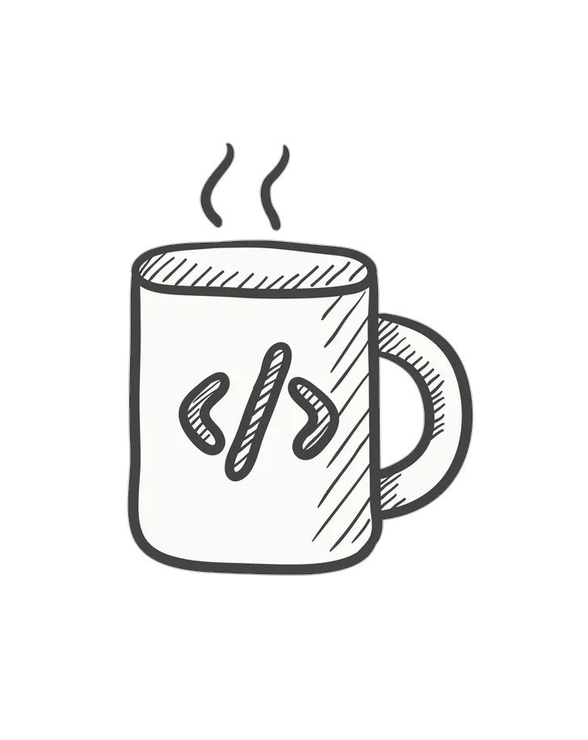
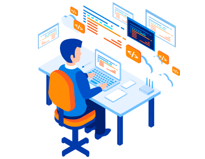

<html>
<html lang="pt-br">
  <head>
    <meta charset="UTF-8">
    <meta name="viewport" content="width=device-width, initial-scale=1, maximum-scale=1.0">
    <title></title>
    
  </head>
    <body>
         <header>
          
           <a id="logo"  href="https://github.com/VitorDev01">Vitor Oliveira</a>
           
           <nav id="nav">
             <button aria-label="Abrir Menu" id="btn-mobile" aria-haspopup="true" aria-controls="menu" aria-expanded="false">
             </button>
             
             <ul id="menu" role="menu">
             <li><a href="https://github.com/VitorDev01">♔ Git Hub</a></li>
              
             <li><a href="https://www.instagram.com/vitorkw89/">♛ Instagram </a></li>
               
             <li><a href="https://wa.me/5524992717594">♘ Contato</a></li>
               
             <li><a href="https://github.com/VitorDev01?tab=repositories">♗ Projetos</a></li>
             
             <li><a href="https://vitordev01.github.io/404-page/">♖ Blog (em desenvolvimento)</a></li>
             
             </ul>
           </nav> 
        </header>
          
         

         
          
         

         

         
         
      
         
21 Anos, barramansanse, Desenvolvedor Front End, conhecimentos autodidata em HTML5 CSS3 e JavaScript, pretendo cursar Análise e Desenvolvimento De Sistemas , fã do raciocínio lógico  amo café e estou sempre buscando aperfeiçoar meu inglês.

Tendo começado essa jornada na programação em 2019 com os professores Gustavo Guanabara e Bruno Campos dos canais Curso em video e CFB cursos.

        
           <!--videos do Yt-->
          <iframe src="https://www.youtube.com/embed/rsFCVjr5yxc" title="YouTube video player" frameborder="0" allow="accelerometer; autoplay; clipboard-write; encrypted-media; gyroscope; picture-in-picture" allowfullscreen></iframe>
           
         <iframe width="360" height="215" src="https://www.youtube.com/embed/lcKo-ycLDNw" title="YouTube video player" frameborder="0" allow="accelerometer; autoplay; clipboard-write; encrypted-media; gyroscope; picture-in-picture" allowfullscreen></iframe>
         
          
           
         <h2>Desenvolvedor Front End</h2>
        
          
         
          
          

          
         
É responsável pela experiência do usuário dentro de uma aplicação web, é ele quem vai desenhar e desenvolver as páginas com as quais, posteriormente, o usuário irá interagir. 
          
        
Tendo como principal Linguagem de programação o JavaScript uma das três principais tecnologias da World Wide Web.A grande maioria dos sites usa, e todos os principais navegadores têm um mecanismo JavaScript dedicado para executá-lo.

         

         
        

        
       <!--comandos Javascript-->
       
      
       <footer>
       <h3>© 2022 VitorDev01 | GitHub Pages</h3>
       </footer>
    </body>
</html>
